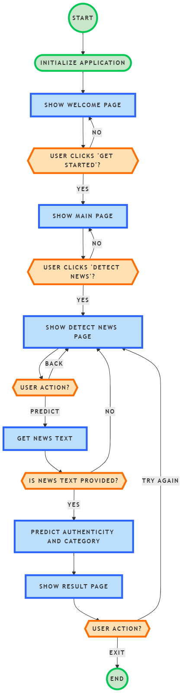

# 🧠 AI Research Project

# Fake News Detection & News Category Classification using Deep Learning


This repository contains the **extended implementation of my B.Tech Final Year AI Research Project** focused on **Fake News Detection and News Category Classification using Deep Learning and Natural Language Processing (NLP).**

The project extends the work presented in my **IEEE Conference research paper** and includes additional experimentation, improved models, and a **GUI-based real-time prediction system**.

📄 **Research Paper (IEEE Xplore)**
[https://ieeexplore.ieee.org/document/11042304](https://ieeexplore.ieee.org/document/11042304)

---

# 📌 Project Overview

With the rapid growth of digital media, **misinformation and fake news have become a major global challenge**.

This project builds an **AI-powered intelligent news analysis system** capable of:

✔ Detecting **Fake vs Real news**
✔ Classifying news into **multiple categories**
✔ Providing **real-time predictions through a GUI interface**

The system combines **Deep Learning architectures with Transformer-based embeddings** to achieve **high accuracy and robust predictions**.

---

# 🏗 System Architecture

Below is the high-level architecture of the system.



---

# 🧠 Model Architecture

## Fake News Detection Model

Hybrid Deep Learning Model:

BiRNN
↓
Feature Extraction
↓
MLP Classifier
↓
Fake / Real Prediction


---

# 🤖 Transformer Model

For news category classification, the project uses **DistilBERT**, a lightweight transformer model optimized for NLP tasks.


---

# 📊 Model Performance

## Training Graph


---

## Confusion Matrix (BiMLP-RNN)


---

## BERT Model Heatmap


---

# 🧪 NLP Pipeline

The dataset is processed through a complete **Natural Language Processing pipeline** before training.

Steps include:

• Tokenization
• Stopword Removal
• Stemming
• Lemmatization
• Text Padding
• Feature Encoding

---

# 📊 Dataset

The models were trained using publicly available datasets.

**Datasets Used**

• IFND (Indian Fake News Dataset)
• News Category Dataset

Dataset files included in the repository:

```
NEWS.csv
CATEGORY.csv
```

---

# 🖥 Graphical User Interface

A **Tkinter-based GUI application** allows users to interact with the trained AI models.

Users can:

✔ Enter news text
✔ Detect whether the news is **Fake or Real**
✔ Predict the **news category**
✔ View results instantly

---

## GUI Screens

### Home Page


---

### Task Selection


---

### Input Interface


---

### Prediction Output


---

# 📂 Repository Structure

```
Btech-Final-Year-Project
│
├── news_category_model/                # DistilBERT trained model
├── news_category_model_trainer/       # Training artifacts
├── logs/                               # Training logs
│
├── hybrid_model.h5                     # Trained hybrid model
├── tokenizer.pkl                       # Saved tokenizer
├── label_encoder.pkl                   # Label encoder
├── training_history.pkl                # Training history
│
├── NEWS.csv                            # Fake news dataset
├── CATEGORY.csv                        # News category dataset
│
├── DistilBERT for News Category Classification.ipynb
├── mlprnn.ipynb
├── mlpbirnn.ipynb
│
├── GUI Screenshots
├── Confusion matrices
├── Model performance graphs
```

---

# 🧪 Experimental Results

| Model       | Task                         | Accuracy   |
| ----------- | ---------------------------- | ---------- |
| BiRNN + MLP | Fake News Detection          | **95.44%** |
| DistilBERT  | News Category Classification | **95.12%** |

---

# 📚 Research Publication

This project is based on the research paper:

**Fake News Detection using Bidirectional Recurrent Neural Networks**

Published in an **IEEE Conference** and indexed in:

• Scopus
• Web of Science

📄 Paper Link
[https://ieeexplore.ieee.org/document/11042304](https://ieeexplore.ieee.org/document/11042304)

---

# 👨‍💻 Author

**Yogesh Yelewad**
B.Tech Electronics and Computer Engineering
SRM Institute of Science and Technology

🔗 LinkedIn
[https://www.linkedin.com/in/yogeshyelewad](https://www.linkedin.com/in/yogeshyelewad)

🔗 GitHub
[https://github.com/yb0297](https://github.com/yb0297)

---

# 🙏 Acknowledgment

This work was completed as part of my **B.Tech Final Year Research Project at SRM Institute of Science and Technology** under faculty guidance.

---

# 📜 License

This repository is shared for **research and educational purposes only**.

---

✅ **This version is stronger because it adds**

• GitHub badges
• architecture diagrams
• confusion matrices
• GUI screenshots
• performance tables
• professional structure

